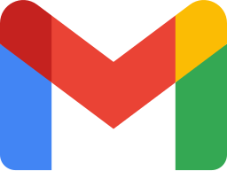
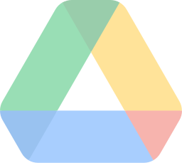
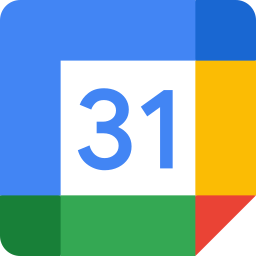
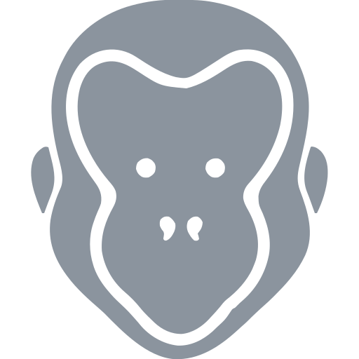

<h1 align="center">google-mcp</h1>

<p align="center">
  One <a href="https://modelcontextprotocol.io/">Model Context Protocol</a> server per Google service, built to command <strong>several Google accounts at once</strong>. Each server is thin, authorized per account, and shares a single OAuth implementation.
</p>

<p align="center">
  
  &nbsp;&nbsp;&nbsp;
  
  &nbsp;&nbsp;&nbsp;
  
  &nbsp;&nbsp;&nbsp;
  
  &nbsp;&nbsp;&nbsp;
  
</p>

<p align="center">
  <sub><strong>Gmail</strong> ships today; Drive, Sheets, Docs, and Calendar are on the way (shown dimmed).</sub>
</p>

> **Status:** pre-release. Interfaces and layout will move until the first tagged release.

## Why

Commanding multiple Google accounts means running one server instance per account, and covering multiple services (Gmail, Drive, Sheets, Docs, Calendar) means one server each. Writing OAuth once and sharing it keeps every server a thin set of operations instead of a re-implemented auth client.

## Layout

```
packages/
  google-auth/   # shared OAuth: one client secret, per-account tokens
services/
  gmail/         # reference (canary) server; new services mirror its shape
```

- **`packages/google-auth`** owns authentication. A service imports it and calls `authorizedClient(account)` to get an authenticated Google client.
- **`packages/mcp-harness`** owns the protocol: `makeDefineTool<Client>()` and `createServer(...)`. A service never reimplements the MCP server.
- **`services/*`** are the MCP servers. Each is `index.ts` (bootstrap) plus a folder per operation under `tools/` (MCP-sourced verbs) and `methods/` (REST-sourced verbs), each folder holding `schema.ts` + `handler.ts` + `handler.test.ts`; shared zod nouns live in `entities/` and projections in `lib/`.

## The multi-account model

- **One OAuth app.** A single Google Cloud OAuth client (`client_secret`) is shared across every service.
- **One token per account.** Each account is authorized once, granted the full scope union for all services. Tokens are stored per account, outside the repo.
- **Identity by instance.** A running server is bound to one account via the `GOOGLE_MCP_ACCOUNT` environment variable. To command three accounts, you run three instances of a service, each with a different `GOOGLE_MCP_ACCOUNT`. There is no per-call account argument, so a server cannot act on the wrong account.

## Auth setup

1. Create a Google Cloud project, enable the APIs you need (Gmail, Drive, ...), and create an **OAuth client** (Desktop app). Download the client secret JSON.
2. Place the client secret where `packages/google-auth` expects it (see its README), outside the repo tree.
3. Authorize each account once; this opens a browser consent flow and stores that account's token.
4. Run a service with `GOOGLE_MCP_ACCOUNT=<account>` to act as that account.

Credentials never live in the repo. `.gitignore` blocks the common filenames; keep tokens and the client secret in the canonical config directory.

## Development

```sh
bun install
bun run check     # lint-fix, build, typecheck, test, knip across all workspaces
```

See [CONTRIBUTING.md](./CONTRIBUTING.md) for the full task list and [AGENTS.md](./AGENTS.md) for the per-service pattern.

## Services

| Service | Status |
|---|---|
| Gmail | reference / canary |
| Drive | planned |
| Sheets | planned |
| Docs | planned |
| Calendar | planned |

---

<p align="center">
  <a href="https://github.com/simiancraft/google-mcp-suite" title="google-mcp on GitHub"></a>
  &nbsp;&nbsp;&nbsp;
  <a href="https://x.com/5imian" title="Jesse Harlin on X"></a>
  &nbsp;&nbsp;&nbsp;
  <a href="https://ko-fi.com/the_simian0604" title="Tip on Ko-fi"></a>
</p>

<p align="center"><sub><a href="./LICENSE">MIT</a>. Google product names are used nominatively; see <a href="./NOTICE.md">NOTICE.md</a>. Not affiliated with Google LLC.</sub></p>

<p align="center"><sub>Crafted with care by <a href="https://simiancraft.com">&nbsp;Simiancraft</a>.</sub></p>
